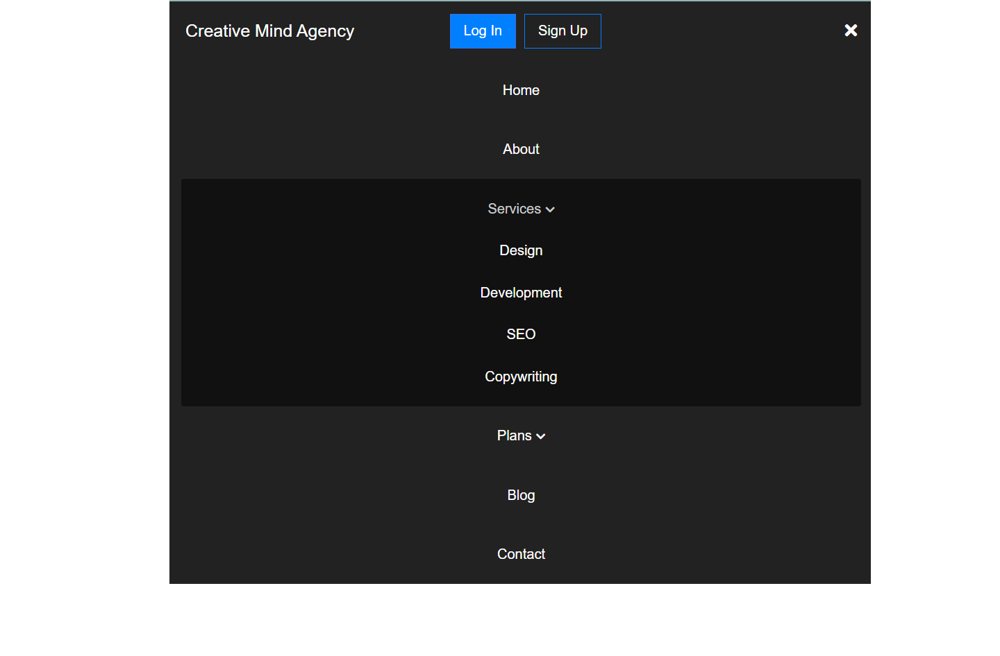

# Exercise | HTML CSS & JavaScript - Responsive Navbar

An exercise to learn a way to make a responsive navbar using CSS and JavaScript

## Screenshots

## Keypoints

- Different unordered lists for the links
- Display Flex to layout elements
- Media queries to change CSS parameters in order to the screen size
- DOM manipulation with JavaScript: changing the class of HTML elements with Event Listeners

## Source

The excercise was done following [this tutorial](https://webdesign.tutsplus.com/how-to-build-a-responsive-navigation-bar-with-flexbox--cms-33535t)